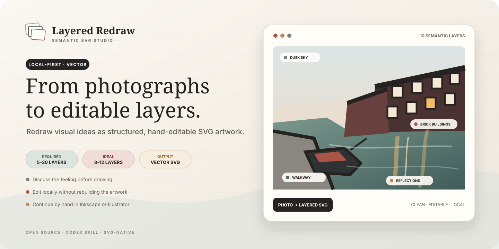
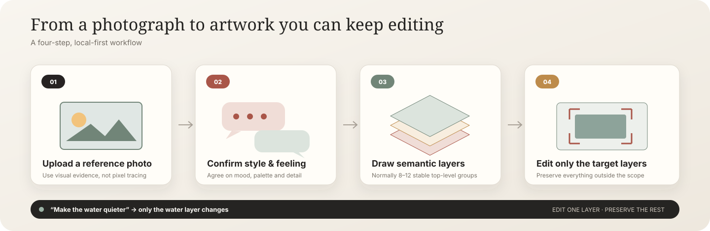
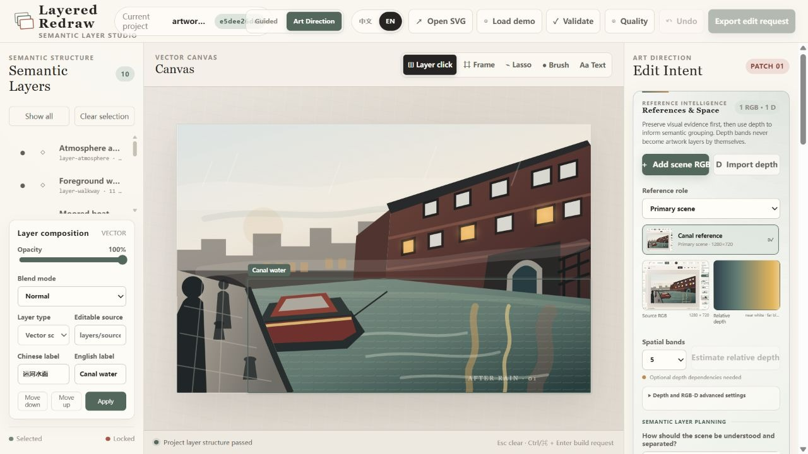
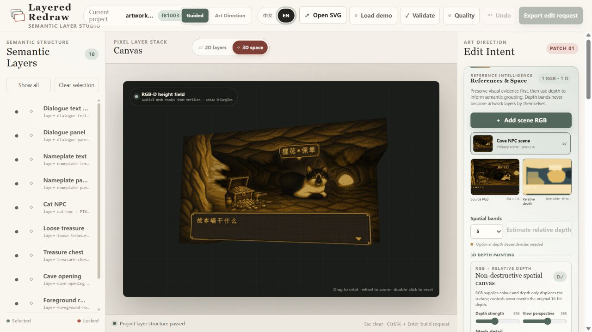
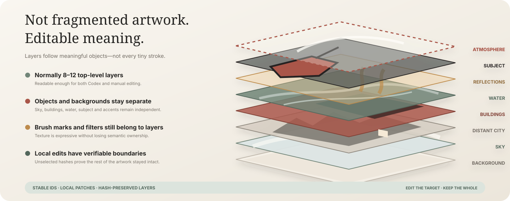
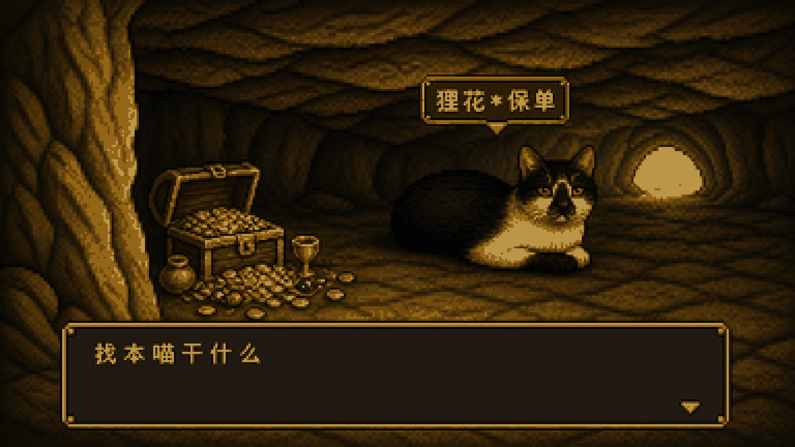
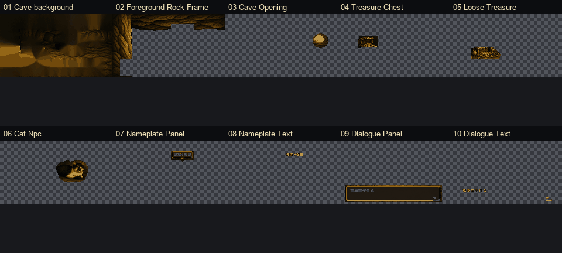

# Layered Redraw · 叠绘

> Discuss the feeling. Redraw in layers.

[简体中文](README.md) | [English](README.en.md)

> **Status: incubation prototype.** This repository is not an integrated or released VULCA SDK capability. Upstreamable residuals are split into small reviewed Effect Packs that reuse canonical SDK contracts; see [`docs/vulca-migration.md`](docs/vulca-migration.md). Code is [Apache-2.0](LICENSE), with asset notes in [PROVENANCE.md](PROVENANCE.md).



Layered Redraw is a local-first Codex plugin and semantic-layer project format for turning references into intentionally redrawn, editable artwork. It favors 8–12 stable layers and treats localized revision as a patch rather than a full regeneration.

It has two independent output modes:

- `vector-strict` (default) never calls an image-generation model; Codex writes SVG geometry, gradients, patterns, and filters directly.
- `raster-layered` uses the available image-generation tool to create registered full-canvas PNG layers with transparency, then composites them into `artwork.png`. A local edit regenerates only selected layers.

Pixel art is a first-class `raster-layered` style preset. It uses a logical pixel canvas, one limited shared palette, binary alpha, and nearest-neighbour preview scaling instead of applying a pixelation filter to ordinary artwork.

v0.6 adds a References & Space workflow. Register multiple RGB inputs, pair supplied depth or optionally estimate relative depth with a Depth Anything V2 backend, then resolve source RGB + depth + prompt into 5–20 semantic layers. Artistic parameters never rewrite raw depth; the prompt controls semantic grouping, independent edit ownership, and spatial interpretation. Guided Creation keeps a small safe surface while Art Direction exposes model, RGB-D orientation, and depth flattening/exaggeration. Artwork text is forbidden by default; an intentional game-UI exception must declare its allowed text layers in the design contract.

v0.7 adds the experimental [3D Scene Builder](apps/scene-builder/README.md). It stages screenplay, characters, props, and cameras in one continuous Three.js scene with hierarchical character roots, arc-length motion, spline cameras, semantic interaction anchors, replaceable model bindings, and a deterministic intent boundary for future intelligent characters. It incubates alongside the 2D layer format and does not present real-time blockout footage as physical simulation or final-film rendering. See [`docs/3d-scene-builder.md`](docs/3d-scene-builder.md) for architecture and boundaries.

v0.8 connects depth to the painting editor itself. The active RGB and paired relative depth form an orbitable WebGL 2.5D height field; GPU-side displacement keeps the depth slider responsive without rebuilding the mesh or rewriting 16-bit evidence. The editor and CLI export `spatial-bridge.json` with RGB/depth hashes, an explicit relative-scale declaration, semantic-layer depth summaries, and a strict Scene Builder adapter boundary. It supports spatial composition and handoff, not metric reconstruction, hidden-surface recovery, or physical simulation.

v0.9 closes the painting-to-stage loop. Scene Builder can now select a Layered Redraw project folder, read `spatial-bridge.json`, resolve and SHA-256-check the declared RGB/depth preview, then mount it as a movable, rotatable, scalable textured height field. The importer preserves the hard relative-2.5D, non-metric, no-hidden-backside, no-collision-by-default boundary and stays separate from OBJ/GLB character rigs, actions, and prop-interaction interfaces.

Before production, the project can generate parameterized A/B/C proofs. The built-in output is a parameter contract, deltas, a low-detail schematic, and an external render request. It becomes image-effect evidence only after scene-specific renders are registered. Selection and promotion can guide the final 8–12 layers, but do not establish artistic quality on their own.

The goal is not another brush picker. A style now changes crop, scale, negative space, depth, shape grammar, and value grouping before colour and surface treatment.

## Understand the workflow in 30 seconds



## The output is more than an interface

<table>
  <tr>
    <td width="50%" align="center">
      <strong>An editable vector artwork</strong><br>
      <sub>The output itself is a hand-editable artwork.svg</sub><br><br>
      
    </td>
    <td width="50%" align="center">
      <strong>A semantic-layer editor</strong><br>
      <sub>Select layers, frame a region, or describe the scope in text</sub><br><br>
      
    </td>
  </tr>
</table>

### RGB + depth → 3D spatial canvas



The active RGB supplies colour while its paired near-white relative depth displaces the surface. The canvas supports orbit, zoom, GPU-side depth, perspective and mesh-detail controls, then exports an evidence-hashed `spatial-bridge.json` with explicit scale boundaries. In Scene Builder, select a carrier, choose **RGB-D 工程**, and pick that project folder to continue camera and scene staging after the RGB/depth hashes pass. This is a 2.5D surface, not a metric scan or full-scene reconstruction.



## Fastest way to use it

### 1. Install the skill

```powershell
git clone https://github.com/RubyYii/Layered-Redraw-.git
cd Layered-Redraw-
$skillTarget = Join-Path $env:USERPROFILE ".codex\skills\redraw-in-layers"
New-Item -ItemType Junction -Path $skillTarget -Target (Resolve-Path ".\skills\redraw-in-layers")
```

Restart Codex.

### 2. Upload a photo and invoke it

```text
Use $redraw-in-layers to process the photo attached to this message.
Ask about the feeling, style, palette, and detail level first.
After approval, create either a vector-strict SVG or raster-layered PNG project with 8–12 semantic layers.
```

### 3. Answer the art-direction interview

Codex confirms mood, composition, style, palette, subject priority, and detail level before drawing. Vector mode outputs `artwork.svg`; raster generation mode outputs an opaque background PNG, transparent upper PNGs, `artwork.png`, an approved brief, and a per-layer manifest.

### 4. Revise a local area

Open the local editor, select layers or frame a region, export `edit-request.json`, and give it back to `$redraw-in-layers`. The patch is allowed to touch only the selected layers.

## What the current version includes

- `$redraw-in-layers`, a Codex skill for guided vector drawing, layered image generation, and localized revision.
- `$stage-in-3d`, a Codex skill that compiles screenplays, storyboards, or scene notes into editable continuous 3D blockouts, cinematic timelines, and deterministic previews.
- An experimental 3D director with continuous scenes, cinematic timelines, fixed-step 30fps rendering, hierarchical characters, curved motion, object interaction anchors, and an auditable agent-intent contract.
- Reference intelligence for role-aware multi-RGB input, RGB-D pairing, optional monocular relative-depth estimation, immutable 16-bit depth evidence, 3–8 diagnostic bands, and prompt-directed 5–20-layer planning.
- A 3D depth canvas that combines source texture and near-white relative depth as a WebGL height field with orbit controls, GPU displacement, mesh/perspective controls, and an auditable spatial-bridge export.
- A painting-to-3D bridge that lets Scene Builder import `spatial-bridge.json` from a project folder, verify the RGB/depth-preview hashes and relative-scale contract, and mount a session-only textured height field through an editable carrier.
- Guided Creation with six composition-first presets and a small set of safe controls for faithfulness, abstraction, subject emphasis, spatial flattening, and colour intensity.
- Art Direction with full control over balance, crop, negative space, subject scale, depth, form, value groups, palette, edge hierarchy, and material, plus reusable bilingual project presets.
- A shared `design-plan.json` whose digest participates in the project revision, making visual-direction changes traceable and recoverable.
- Parameterized proofs in structure, colour/material, or full stages: exactly A/B/C with deltas, rendered-PNG registration, selection, locking, and recoverable promotion.
- A strict dual-mode project contract: 5–20 non-empty semantic layers, normally 8–12.
- Python utilities for validation, manifests, SVG exports, PNG composition, scoped patches, and editor serving. Vector features are dependency-free; raster features use Pillow.
- A local browser editor with distinct Chinese / English copy, layer click, rectangle selection, pure-text mode, visibility/lock controls, client-side validation, and `edit-request.json` export.
- A ten-layer canal demonstration project made only from vector paths, shapes, gradients, patterns, and SVG filters.
- Hash protection for unchanged layers, preventing a local adjustment from silently rebuilding the entire artwork.
- `raster-layered` support for same-size RGBA PNGs, alpha and dimension checks, deterministic composition, and scoped `replace-layer-file` patches.
- A `pixel-art` preset with 320×240, 32 colors, and 4× nearest-neighbour preview defaults plus validation for partial alpha, layer opacity, and project-wide palette overflow.
- Recoverable history for patches, layer settings, restores, and ORA sync, with `history`, `diff`, and reversible `undo`.
- Lasso and brush masks stored as full-canvas binary PNGs and combined with semantic layer scope.
- Layer controls for opacity, visibility, locks, order, bilingual labels, and six deterministic blend modes.
- Hybrid layer metadata: every layer keeps a registered PNG render and may declare raster, pixel, or vector source with an editable SVG.
- Ten composition-to-rhythm style parameter contracts, 2–6 candidate direction boards, layer dependencies, and separate engineering quality, plan-schema completeness, and human visual-confirmation states.
- OpenRaster export/import for continuing in Krita and syncing manual work back into the project.

The editor now saves composition settings, masks, and history restores directly. Codex still interprets artistic language: give it the exported request with `$redraw-in-layers` to create a scoped SVG patch or PNG replacement and verify unchanged layer hashes.

## Editable pixel NPC example





[`examples/cat-cave-npc`](examples/cat-cave-npc) is an accepted-master decomposition and delivery fixture that can be inspected, edited, and recomposed directly: 384×216 pixels, a 32-colour budget, and ten semantic layers for the cave, foreground rocks, cave opening, treasure chest, loose treasure, cat NPC, nameplate, and dialogue UI. It proves PNG/mask/ORA round-trip and engineering contracts; it is not an end-to-end source-to-effect demo. The private source photograph is intentionally excluded.

## Try the editor

Vector mode needs only Python 3.10 or newer. Raster validation and composition additionally require Pillow; local depth estimation is a separate optional extra:

```powershell
python -m pip install Pillow
# Only when local depth estimation is needed:
python -m pip install -r requirements-depth.txt
python skills/redraw-in-layers/scripts/layered_redraw.py validate examples/canal-evening --write-manifest
python skills/redraw-in-layers/scripts/layered_redraw.py serve examples/canal-evening --open
```

If the browser does not open automatically, visit `http://127.0.0.1:8765/`.

In the editor:

1. Choose Guided Creation or Art Direction in the header, then select 中文 or EN.
2. In References & Space, add the primary scene and supporting inputs. Estimate relative depth when useful, or import same-size single-channel RGB-D depth in Art Direction mode.
3. Once depth is paired, open the 3D canvas and drag to inspect the spatial reading; export the bridge JSON when a downstream adapter needs it.
4. Describe which objects should stay separate, merge, or become overlays; choose a 5–20 layer target and save the planning request.
5. Choose a visual system or expert parameters, then generate, select, lock, and promote an A/B/C proof.
6. Select semantic layers or constrain an edit with layer click, frame, lasso, brush, or text-described scope.
7. Adjust opacity, blend, order, and bilingual labels; compare or restore history.
8. Describe the change, download `edit-request.json`, and give it to Codex with `$redraw-in-layers`.

### Run the 3D Scene Builder

```powershell
cd apps/scene-builder
npm ci
npm run dev
```

Open the local URL printed by Vite to use blockout editing, the director timeline, and scene preview. The bundled *Window That Wasn't There* fixture can be loaded from the editor. Rebuild the fixture or render deterministic 30fps video with:

```powershell
npm run build:window-case
npm run render:window-case:video30
```

The editor can now import OBJ or a self-contained GLB for a selected object during the browser session and fit it inside the placeholder without distorting its proportions. OBJ is treated as static geometry. A GLB additionally reports skins, bones, animation clips, and morph targets, then infers semantic nodes, `idle/move/interact/react` actions, common rig bones, and expression slots. The runtime exposes `playAssetAction`, `setAssetExpression`, and `setAssetBonePose`, so a future character swap does not have to rewrite scene tracks. Expanded static collision bounds can also produce a deterministic approach path for an out-of-range agent intent. Model files are not packaged with project JSON yet; hand IK, animation retargeting, a navigation mesh, and rigid-body solving remain follow-up work.

You can also invoke the 3D skill directly:

```text
Use $stage-in-3d to stage this screenplay as one continuous 3D scene, block the characters, props, and cameras, then render a 30fps preview.
```

## Invoke the skill

During development, expose the repository skill through a directory junction. The command fails safely if a skill with the same name already exists.

```powershell
$skillTarget = Join-Path $env:USERPROFILE ".codex\skills\redraw-in-layers"
New-Item -ItemType Junction -Path $skillTarget -Target (Resolve-Path ".\skills\redraw-in-layers")
```

Restart Codex and use a prompt such as:

```text
Use $redraw-in-layers to process the photo attached to this message.
Interview me about the art direction first. After approval, create a vector-strict SVG project with 8–12 semantic layers.
```

For layered image generation:

```text
Use $redraw-in-layers in raster-layered mode for the photo attached to this message.
Do not output vector art. Generate 8–12 registered PNG layers, with an opaque background and transparent upper layers, and composite artwork.png.
```

For layered pixel art:

```text
Use $redraw-in-layers in raster-layered / pixel-art mode for the attached photo.
Use a 320×240 logical canvas, one shared 32-color palette, and a 4× nearest-neighbour preview. Forbid anti-aliasing, blur, gradients, and partial-alpha edges.
Output 8–12 independently editable PNG layers, artwork.png, and preview.png.
```

For Guided Creation:

```text
Use $redraw-in-layers in Guided Creation mode for this photo.
Show me composition-first visual presets. Do not merely change brushes, and do not add artwork text.
```

For Art Direction:

```text
Use $redraw-in-layers in Art Direction mode for this photo.
Let me control crop, subject proportion, negative space, spatial flattening, shape simplification, value groups, palette, edges, and material before detailed drawing.
```

For RGB + prompt + depth-controlled layer planning:

```text
Use $redraw-in-layers to register the photo attached to this message and estimate relative depth.
Keep the figure in its own layer, merge distant buildings, and make reflections an overlay; target 10 layers.
Preserve raw depth evidence and apply art direction only to the layer-level spatial interpretation.
```

For parameterized proofs:

```text
Use $redraw-in-layers to create three A/B/C parameterized proofs for this photo before production.
Compare structure first; after I select and lock the composition, create colour/material proofs and promote the accepted plan into the final 8–12-layer production pass.
```

For an existing project:

```text
Use $redraw-in-layers to read this project and edit-request.json.
Change only the layers targeted by the request and verify that every other top-level layer hash remains unchanged.
```

## Project format

```text
vector-project/                 raster-project/
├─ artwork.svg                  ├─ artwork.png
├─ project.json                 ├─ project.json
├─ creative-brief.json          ├─ creative-brief.json
├─ design-plan.json             ├─ design-plan.json
├─ planning-request.json        ├─ planning-request.json
├─ layer-plan.json              ├─ layer-plan.json
├─ references/                  ├─ references/
├─ manifest.json                ├─ manifest.json
├─ style-recipe.json            ├─ style-recipe.json
├─ presets/user/                ├─ presets/user/
├─ proofs/sets/                 ├─ proofs/sets/
├─ history/ and masks/          ├─ history/ and masks/
├─ directions/                  ├─ directions/
├─ layers/*.svg                 ├─ composition.json
└─ patches/                     ├─ layers/index.json + *.png
                                ├─ prompts/ and staging/
                                └─ patches/
```

Top-level layers use portable SVG groups plus Inkscape layer metadata:

```xml
<g id="layer-water"
   data-layer="true"
   inkscape:groupmode="layer"
   inkscape:label="Water">
  <!-- editable water objects -->
</g>
```

For vector projects, `artwork.svg` is canonical. For raster projects, `layers/index.json` and the PNG stack are canonical; `artwork.png` and `preview.png` can be recomposed at any time.

## Command line

```powershell
# Create an empty 10-layer project skeleton
python skills/redraw-in-layers/scripts/layered_redraw.py new output/my-project --title "My Project"

# Create a ten-layer generated raster project
python skills/redraw-in-layers/scripts/layered_redraw.py new output/my-raster-project --mode raster-layered --layers 10 --width 1200 --height 1600

# Create a pixel-art project; omitted dimensions default to 320×240
python skills/redraw-in-layers/scripts/layered_redraw.py new output/my-pixel-project --mode raster-layered --style pixel-art --layers 10 --palette-size 32 --pixel-scale 4

# Register RGB, estimate relative depth, and save prompt-directed layer intent
python skills/redraw-in-layers/scripts/layered_redraw.py reference-add output/my-project scene.jpg --role primary-rgb
python skills/redraw-in-layers/scripts/layered_redraw.py depth-estimate output/my-project --zones 5 --device auto
python skills/redraw-in-layers/scripts/layered_redraw.py plan-request output/my-project "Keep the figure separate; merge distant buildings; use reflections as an overlay" --layers 10

# For existing RGB-D, import same-size single-channel depth and declare its near direction
python skills/redraw-in-layers/scripts/layered_redraw.py depth-register output/my-project depth.png --raw-near high

# Export the non-destructive RGB + relative-depth 3D height-field contract
python skills/redraw-in-layers/scripts/layered_redraw.py spatial-bridge output/my-project --displacement 0.65 --resolution 96

# After Codex writes semantic-regions.json, resolve the formal layer plan deterministically
python skills/redraw-in-layers/scripts/layered_redraw.py plan-resolve output/my-project semantic-regions.json

# Composite the PNG stack after accepted layers are in place
python skills/redraw-in-layers/scripts/layered_redraw.py compose output/my-raster-project

# Validate and refresh manifest.json
python skills/redraw-in-layers/scripts/layered_redraw.py validate output/my-project --write-manifest

# Export each semantic layer as its own SVG
python skills/redraw-in-layers/scripts/layered_redraw.py split output/my-project

# Preview a structured patch without writing
python skills/redraw-in-layers/scripts/layered_redraw.py apply-patch output/my-project patch.json --dry-run

# Apply a validated patch and create an audit record
python skills/redraw-in-layers/scripts/layered_redraw.py apply-patch output/my-project patch.json

# Quality, recoverable history, diff, and undo
python skills/redraw-in-layers/scripts/layered_redraw.py quality output/my-project
python skills/redraw-in-layers/scripts/layered_redraw.py history output/my-project
python skills/redraw-in-layers/scripts/layered_redraw.py diff output/my-project <snapshot-id>
python skills/redraw-in-layers/scripts/layered_redraw.py undo output/my-project <snapshot-id>

# Non-destructive composition settings
python skills/redraw-in-layers/scripts/layered_redraw.py layer-settings output/my-project layer-lighting --opacity 0.7 --blend-mode screen

# Style recipes and direction proofs
python skills/redraw-in-layers/scripts/layered_redraw.py styles
python skills/redraw-in-layers/scripts/layered_redraw.py presets --project output/my-project
python skills/redraw-in-layers/scripts/layered_redraw.py apply-preset output/my-project editorial-geometric --control abstraction=0.7
python skills/redraw-in-layers/scripts/layered_redraw.py design output/my-project
python skills/redraw-in-layers/scripts/layered_redraw.py design-check output/my-project
python skills/redraw-in-layers/scripts/layered_redraw.py save-preset output/my-project my-direction --name-zh "我的方向" --name-en "My direction"
python skills/redraw-in-layers/scripts/layered_redraw.py direction-board output/my-project --candidate "A=a.png" --candidate "B=b.png"

# Generate, compare, lock, and promote parameterized proofs
python skills/redraw-in-layers/scripts/layered_redraw.py proof-create output/my-project --stage structure --spread 0.65
python skills/redraw-in-layers/scripts/layered_redraw.py proof-select output/my-project B
python skills/redraw-in-layers/scripts/layered_redraw.py proof-lock output/my-project
python skills/redraw-in-layers/scripts/layered_redraw.py proof-promote output/my-project

# OpenRaster round trip with Krita or another ORA editor
python skills/redraw-in-layers/scripts/layered_redraw.py export-ora output/my-raster-project
python skills/redraw-in-layers/scripts/layered_redraw.py import-ora edited.ora output/my-raster-project
```

Vector patches support `set-attributes`, `remove-attributes`, `set-text`, `replace-element`, and `remove-element`. Raster patches support `replace-layer-file`. Every operation must stay inside `expected_changed_layers`.

## Manual editing

Open `artwork.svg` in Inkscape for the safest round trip. Illustrator and Affinity Designer are also suitable, but run validation afterward because another editor may rename IDs or restructure groups. Modify objects inside a layer; preserve the top-level `layer-*` wrapper and ID.

For raster projects, import `layers/*.png` into Photoshop, Affinity Photo, Krita, or Photopea in the bottom-to-top order declared by `index.json`. Preserve canvas dimensions, alpha, and filenames, then run `compose` and `validate`.

For the safest Krita workflow, run `export-ora`, edit the complete stack, then sync it back with `import-ora`. The import takes a recoverable snapshot and rejects canvas, layer-count, or stable-ID mismatches.

For pixel art, prefer Aseprite or Pixelorama. Disable anti-aliasing, use nearest-neighbour for every transform, and preserve the shared palette and binary alpha.

## Tests

```powershell
python -m unittest discover -s tests -v
cd apps/scene-builder
npm ci
npm test
npm run build
```

The tests cover SVG, raster, pixel art, both design interfaces, custom presets, parameterized proofs, complete style systems, direction boards, masks, history diff/restore, hybrid sources, and OpenRaster round trips. The 3D application separately covers scene schema, timelines, arc-length motion, semantic interactions, and the model-intent boundary.

---

[← 中文文档](README.md)
