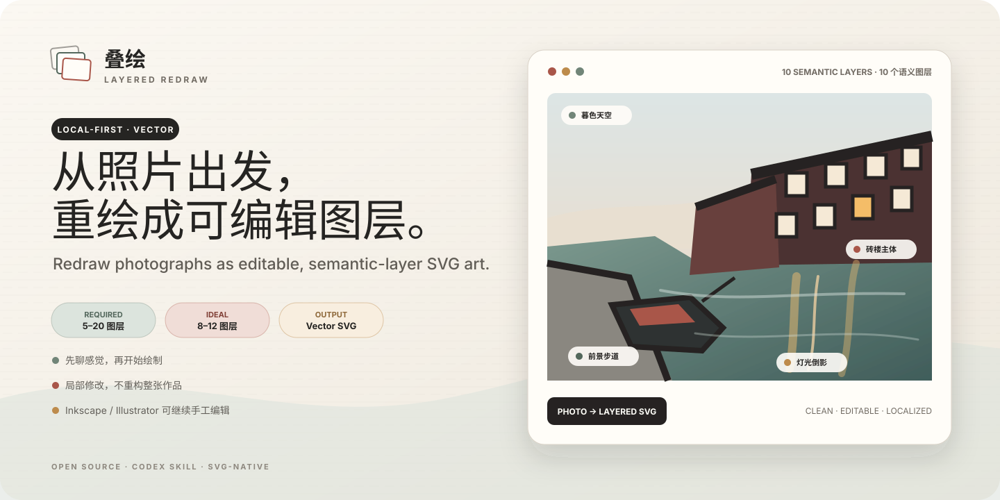
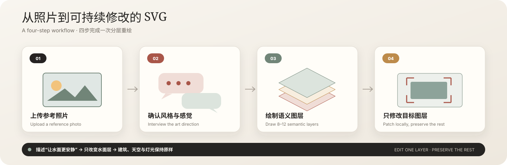
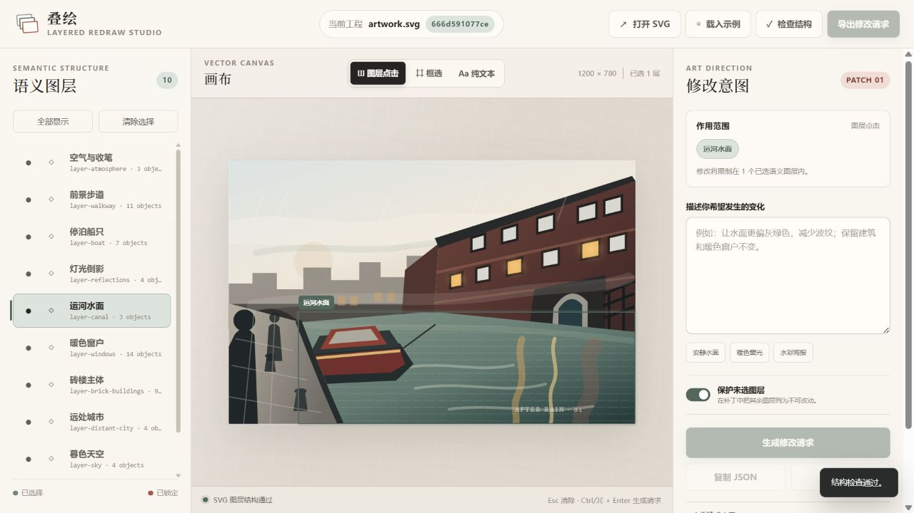
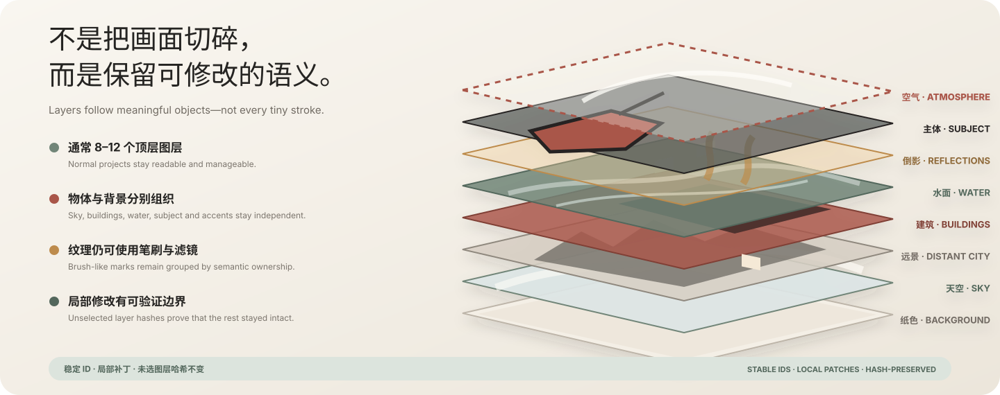

# Layered Redraw · 叠绘

> Discuss the feeling. Redraw in layers.

[简体中文](README.md) | [English](README.en.md)



Layered Redraw is a local-first Codex plugin and SVG project format for turning reference photographs into intentionally redrawn, editable vector artwork. It favors 8–12 stable semantic layers, supports multiple drawing styles, and treats localized revision as a patch rather than a full regeneration.

The project deliberately does **not** call an image-generation model. Codex analyzes the reference, conducts a short art-direction interview when needed, and writes SVG geometry directly.

## Understand the workflow in 30 seconds



## The output is more than an interface

<table>
  <tr>
    <td width="50%" align="center">
      <strong>An editable vector artwork</strong><br>
      <sub>The output itself is a hand-editable artwork.svg</sub><br><br>
      
    </td>
    <td width="50%" align="center">
      <strong>A semantic-layer editor</strong><br>
      <sub>Select layers, frame a region, or describe the scope in text</sub><br><br>
      
    </td>
  </tr>
</table>



## Fastest way to use it

### 1. Install the skill

```powershell
git clone https://github.com/RubyYii/Layered-Redraw-.git
cd Layered-Redraw-
$skillTarget = Join-Path $env:USERPROFILE ".codex\skills\redraw-in-layers"
New-Item -ItemType Junction -Path $skillTarget -Target (Resolve-Path ".\skills\redraw-in-layers")
```

Restart Codex.

### 2. Upload a photo and invoke it

```text
Use $redraw-in-layers to process the photo attached to this message.
Ask about the feeling, style, palette, and detail level first.
After approval, create a vector-strict SVG project with 8–12 semantic layers.
```

### 3. Answer the art-direction interview

Codex confirms mood, composition, style, palette, subject priority, and detail level before drawing. The default project includes `artwork.svg`, an approved brief, a per-layer manifest, and individual layer exports.

### 4. Revise a local area

Open the local editor, select layers or frame a region, export `edit-request.json`, and give it back to `$redraw-in-layers`. The patch is allowed to touch only the selected layers.

## What v0.1 includes

- `$redraw-in-layers`, a Codex skill for guided photo-derived SVG drawing and localized revision.
- A strict project contract: 5–20 non-empty top-level semantic layers, normally 8–12.
- A dependency-free Python utility for validation, manifests, layer exports, scoped patches, and editor serving.
- A local browser editor with layer click, rectangle selection, pure-text mode, visibility/lock controls, client-side validation, and `edit-request.json` export.
- A ten-layer canal demonstration project made only from vector paths, shapes, gradients, patterns, text, and SVG filters.
- Hash protection for unchanged layers, preventing a local adjustment from silently rebuilding the entire artwork.

The editor currently **authors edit requests**; it does not interpret artistic language or mutate the SVG by itself. Give the exported request to Codex with `$redraw-in-layers`, which creates a structured patch and verifies unchanged layer hashes.

## Try the editor

Python 3.10 or newer is sufficient; there are no third-party packages.

```powershell
python skills/redraw-in-layers/scripts/layered_redraw.py validate examples/canal-evening --write-manifest
python skills/redraw-in-layers/scripts/layered_redraw.py serve examples/canal-evening --open
```

If the browser does not open automatically, visit `http://127.0.0.1:8765/`.

In the editor:

1. Select a semantic layer from the left panel or click an object on the canvas.
2. Switch to rectangle selection to select a visual region, or choose pure-text mode to let Codex infer the target.
3. Describe the desired change in Chinese or English.
4. Generate and download `edit-request.json`.
5. Attach the project and request to Codex, then invoke `$redraw-in-layers`.

## Invoke the skill

During development, expose the repository skill through a directory junction. The command fails safely if a skill with the same name already exists.

```powershell
$skillTarget = Join-Path $env:USERPROFILE ".codex\skills\redraw-in-layers"
New-Item -ItemType Junction -Path $skillTarget -Target (Resolve-Path ".\skills\redraw-in-layers")
```

Restart Codex and use a prompt such as:

```text
Use $redraw-in-layers to process the photo attached to this message.
Interview me about the art direction first. After approval, create a vector-strict SVG project with 8–12 semantic layers.
```

For an existing project:

```text
Use $redraw-in-layers to read this project and edit-request.json.
Change only the layers targeted by the request and verify that every other top-level layer hash remains unchanged.
```

## Project format

```text
project-name/
├─ artwork.svg             # canonical editable source
├─ project.json            # output mode, style, seed, canonical path
├─ creative-brief.json     # approved art direction
├─ manifest.json           # revision and per-layer hashes
├─ layers/                 # regenerated per-layer SVG exports
└─ patches/                # applied patch audit records
```

Top-level layers use portable SVG groups plus Inkscape layer metadata:

```xml
<g id="layer-water"
   data-layer="true"
   inkscape:groupmode="layer"
   inkscape:label="Water">
  <!-- editable water objects -->
</g>
```

`artwork.svg` is the source of truth. `manifest.json` and `layers/` are derived and may be rebuilt.

## Command line

```powershell
# Create an empty 10-layer project skeleton
python skills/redraw-in-layers/scripts/layered_redraw.py new output/my-project --title "My Project"

# Validate and refresh manifest.json
python skills/redraw-in-layers/scripts/layered_redraw.py validate output/my-project --write-manifest

# Export each semantic layer as its own SVG
python skills/redraw-in-layers/scripts/layered_redraw.py split output/my-project

# Preview a structured patch without writing
python skills/redraw-in-layers/scripts/layered_redraw.py apply-patch output/my-project patch.json --dry-run

# Apply a validated patch and create an audit record
python skills/redraw-in-layers/scripts/layered_redraw.py apply-patch output/my-project patch.json
```

Supported deterministic patch operations are `set-attributes`, `remove-attributes`, `set-text`, `replace-element`, and `remove-element`. Every operation must stay inside `expected_changed_layers`.

## Manual editing

Open `artwork.svg` in Inkscape for the safest round trip. Illustrator and Affinity Designer are also suitable, but run validation afterward because another editor may rename IDs or restructure groups. Modify objects inside a layer; preserve the top-level `layer-*` wrapper and ID.

## Tests

```powershell
python -m unittest discover -s tests -v
```

The tests validate the demonstration project, split all ten layers, apply a one-layer patch in a temporary copy, and confirm that every unselected layer hash remains unchanged.

---

[← 中文文档](README.md)
