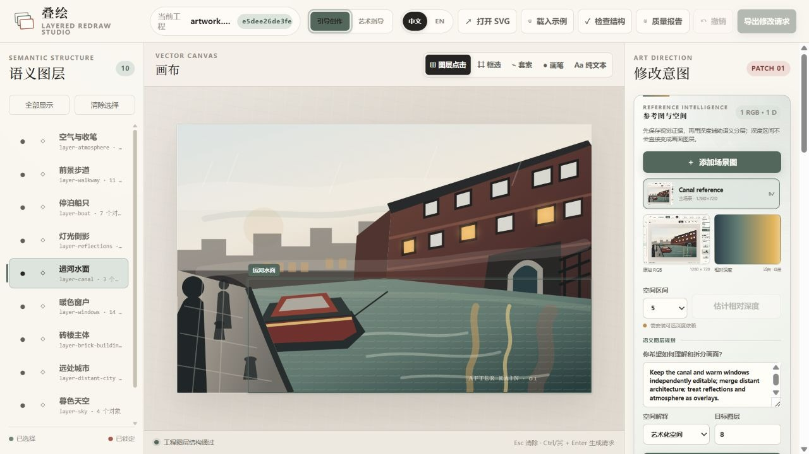
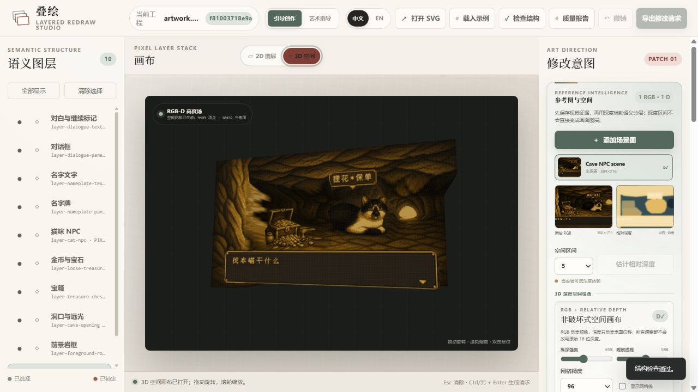

# Layered Redraw · 叠绘

> 讨论感觉，分层重绘。
>
> Discuss the feeling. Redraw in layers.

[简体中文](README.md) | [English](README.en.md)

> **项目状态：孵化原型。** 本仓库不是 VULCA SDK 已集成或已发布的能力。可上游的功能将拆成小型、经审查的 Effect Pack，复用 canonical SDK 契约；迁移边界见 [`docs/vulca-migration.md`](docs/vulca-migration.md)。代码采用 [Apache-2.0](LICENSE)，资产来源见 [PROVENANCE.md](PROVENANCE.md)。


Layered Redraw 是一个本地优先的 Codex 插件与多图层工程格式。它以参考照片为视觉依据，通过简短的创作访谈，将照片重绘为可编辑、可持续修改的语义图层作品。

项目默认使用 8–12 个稳定的语义图层，支持简笔画、海报、素描、水彩、油画、篆刻等不同绘制方向，并把局部修改视为受约束的图层补丁，而不是重新生成整张作品。

现在包含两种彼此独立的输出模式：

- `vector-strict`（默认）：不调用生图模型，由 Codex 直接绘制 SVG 几何、渐变、纹理和滤镜。
- `raster-layered`：调用可用的图像生成工具，生成同尺寸、可透明叠加的 PNG 语义图层，再合成为 `artwork.png`。局部修改只重新生成被选图层。

像素画是 `raster-layered` 的正式风格预设：使用逻辑像素画布、共享有限色板、0/255 硬透明和最近邻放大预览，而不是对普通图片套像素化滤镜。

v0.6 新增“参考图与空间”工作流：可注册多张 RGB 参考、导入配对深度图或用可选的 Depth Anything V2 后端估计相对深度，再把“原图 + 深度 + 提示词”解析为 5–20 个语义图层。原始深度永不被艺术参数改写；提示词只控制语义合并、独立编辑关系和空间解释。普通的“引导创作”保留少量安全参数，“艺术指导”开放模型、RGB-D 方向与空间压平／夸张。作品文字默认禁止；确需游戏 UI 等文字时，必须在设计合同中列出允许的文字图层。

v0.7 新增实验性的 [3D Scene Builder](apps/scene-builder/README.md)：把剧本、角色、物品和镜头放进同一个连续 Three.js 场景，提供角色层级根节点、弧长运动、样条摄影机、语义交互锚点、可替换模型绑定，以及面向未来智能角色的确定性意图边界。它与 2D 图层工程并列孵化，不把实时灰模预演宣称为物理仿真或最终电影画质。架构和边界见 [`docs/3d-scene-builder.md`](docs/3d-scene-builder.md)。

v0.8 把深度真正接进绘画编辑器：当前 RGB 与配对相对深度可以生成可拖动旋转、滚轮缩放的 WebGL 2.5D 高度场；纵深强度在 GPU 中实时调整，不会反复重建网格或改写 16 位深度证据。编辑器和命令行都能导出带 RGB／深度哈希、相对尺度声明、语义层深度摘要与 Scene Builder 适配边界的 `spatial-bridge.json`。它适合空间构图和接口交接，但不冒充米制重建、隐藏表面恢复或物理仿真。

v0.9 打通绘画与 3D 舞台：Scene Builder 现在可以选择一个 Layered Redraw 工程文件夹，读取 `spatial-bridge.json`，自动定位并校验 RGB／深度预览的 SHA-256，再把它装载为可移动、旋转、缩放的纹理高度场。导入保留“相对 2.5D、非米制、无隐藏背面、默认无碰撞”的硬边界，并与 OBJ／GLB 角色模型、骨架、动作和物品交互接口保持分离。

v1.0 增加连续交互仿真切片：导演预览以固定 60Hz 步进，语义交互可以执行 `claim → transfer → release` 所有权转换，物品通过角色持有锚点、物品抓取锚点和接触面锚点连续求解。右上角菜单可直接载入十秒“接近—抓取—携带—交接—放置”实验室，并以逐帧方式稳定导出 30 FPS 视频。当前后端是确定性运动学约束，不冒充 Rapier 刚体、重力或完整手部 IK。

v1.1 为这个切片增加可审计的防穿模层：角色根使用胶囊代理避开静态箱体，物品在支撑面上进行二次校正，灰模双手落在物品相对表面并在携带段保持接触，不再汇聚到物体中心。预览 HUD 报告修正数量和残余穿透；30 FPS 渲染会保存拾取、两段携带、交接、放置和完成关键帧，并在任一关键帧残余穿透不为零时失败。它仍是离散运动学代理，不是连续碰撞检测或刚体世界。

v1.2 完成《不存在的窗》全剧本确定性成片：同一房间内的 200 个对象、4 个非人角色、19 个镜头和 720 段轨道连续运行 166 秒，并将 30 条英文画面提示烧录到 4,980 帧、1280×720、严格 30fps 的 VP8 WebM。角色路线、证物搬运和照片“抬起—平移—放下”动作已针对穿模重排；回归测试逐一检查全部 4,981 个含端点时间样本，要求零残余穿透和零交互状态违规。成片仍是风格化实时 3D 预演，不冒充写实电影渲染。

v1.3 把视频输出升级为“可复现仿真交付包”：两条 30fps 渲染命令在成片之外同步冻结场景、资产锁、逐帧状态增量、交互／所有权记录、碰撞报告和渲染报告，并附带完全离线的 WebGL 回放器与 SHA-256 验证器。`simulationIdentity` 只由确定性仿真输入与结果组成，不受绝对路径、机器、墙钟耗时影响；非法所有权或残余穿透会留下可检查的 `FAIL` 包，而不是只丢出一个视频。

v1.4 增加可视化“电影镜头编辑器”：时间线中的相机片段可以直接选择，当前透视视口可一键记录为镜头 A／B 位姿，并可精确修改开始时间、时长、FOV、位置、注视点、minimum-jerk／柔和／匀速曲线及 3–16 点摄影机与注视轨道。单镜头区间可独立播放，新增、复制、修改和删除都进入原有撤销历史；不会重新编译或改写未选中的角色、物品、对白与其他镜头轨道。

v1.5 完成 3D 硬化与 CP03 本地观众切片：4 MB 以上大型工程改由 IndexedDB 自动恢复；OBJ／GLB／动作 GLB／RGB-D 可进入 SHA-256 内容库并导出跨机器 `.blockout.zip`。带骨架 GLB 支持动作重定向和接触点驱动的双骨手部 IK，角色寻路改为三角导航网格，未被时间线／所有权控制的动态物体由按需 Rapier WASM 重力与碰撞世界求解。`?case=pact-cp03` 提供五动作、哈希审批、Capability Gate、真实 Three.js 瞬态效果和 Ruby 回执的零调用观众 UI。Agent Host 同时实现五角色并行 critical path、6/8 调用预算、Provider 路由审计与五类 checkpoint fail-closed 归档合同；这些本地实现不等于 Gemini／DeepSeek Live Run 已通过，也不等于正式 CP03 归档已产生。

v1.6 增加可替换角色控制层：`idle / approach / look / reach / grasp / carry / transfer / release / speak` 状态机统一驱动动作 CrossFade、双手／双脚 CCD 约束、头颈注视与静止阶段脚底锁定。骨架映射编辑器提供 25 个语义槽位、自动推断、缺失／重复诊断、实时姿势／双手／脚锁测试，并把选择写回可移植工程。未来大模型只可提交 `approach / look / reach / grasp / transfer / release / speak` 七种语义动作；路径、变换、碰撞、动画、IK 与所有权仍由确定性运行时生成，并返回 SHA-256 绑定回执。

v1.7 强化多人 IK 稳定性：四肢目标会按模型当前世界尺度限制在真实可达环带内，远目标不再把骨链推到直线奇点，零长度／非有限骨段会安全降级。导演时间线把同一帧的脚锁、视线和双手更新批量提交为一次求解；交互预览按可见性与视距平滑切换 1–8 次迭代，选中角色与固定步长导出始终保持完整 8 次预算。

v1.8 增加阶段感知的角色表演层：`anticipation / reach / contact / recovery` 会随时间线进入状态机，双手动作按物体宽度和角色本地右轴生成有界、对称的接触点，单手与双手约束在抓取、携带、交接和放置阶段连续保持。角色状态同时驱动脚锁、注视权重及确定性的 Morph 表情；对白提供可复现的口部开合与眨眼包络。它仍不是音素级口型、手指 IK、重心平衡或步态规划。

v1.9 增加“单图 → OBJ / 骨架”工作台：选中载体后导入 PNG／JPEG／WebP，浏览器按需下载并缓存 Depth Anything V2，以 WebGPU 优先、WASM 回退的方式在本机估算相对深度。断层保护网格可导出带顶点色、UV 和法线的静态 OBJ；正面人形图还能在原图上拖动 22 个关节点，生成四权重蒙皮 GLB，并继续进入已有骨架映射、IK 与动作重定向。每次生成都把模型、处理后 RGB、深度 PNG 和 rig 配方作为四个 SHA-256 工件打入可移植工程包。单图结果仍是可见表面的非米制 2.5D 浮雕，不恢复背面或真实体积。

正式绘制前还可以生成带参数的 A/B/C 设计稿。当前内置输出是参数合同、差异、低细节示意和外部真实渲染请求；只有注册了真实场景渲染后，才能作为画面效果证据。选择并锁定一个方案后，它可以晋升为最终 8–12 图层绘制的设计依据，但这本身不等于艺术质量已经成立。

这次升级的重点不是增加更多笔刷，而是让风格先改变画面设计：重新裁切、调整主体尺度、组织留白、压平或强化透视、概括形状、重组明暗，再决定色彩与材质。

## 30 秒理解工作方式


## 你得到的不只是一个使用界面

<table>
  <tr>
    <td width="50%" align="center">
      <strong>可编辑的矢量作品</strong><br>
      <sub>输出本身就是可以继续修改的 artwork.svg</sub><br><br>
      
    </td>
    <td width="50%" align="center">
      <strong>语义图层编辑器</strong><br>
      <sub>选图层、框选区域或用纯文本描述修改范围</sub><br><br>
      
    </td>
  </tr>
</table>

### RGB + 深度 → 3D 空间画布



当前场景 RGB 提供颜色纹理，配对的近白相对深度提供表面位移。画布支持旋转、缩放、实时 GPU 纵深、透视与网格精度控制，并可导出带证据哈希和尺度边界的 `spatial-bridge.json`。在 Scene Builder 中选中一个载体，点击“RGB-D 工程”并选择该工程文件夹，即可在校验 RGB／深度哈希后继续进行 3D 运镜和场景编排。这是 2.5D 高度场，不是米制扫描或完整场景重建。


## 最短使用方法

### 1. 安装 Skill

```powershell
git clone https://github.com/RubyYii/Layered-Redraw-.git
cd Layered-Redraw-
$skillTarget = Join-Path $env:USERPROFILE ".codex\skills\redraw-in-layers"
New-Item -ItemType Junction -Path $skillTarget -Target (Resolve-Path ".\skills\redraw-in-layers")
```

重启 Codex。

### 2. 上传照片并调用

```text
使用 $redraw-in-layers 处理本条上传的照片。
先询问我希望的感觉、风格、配色和细节程度。
确认后，根据我的选择生成 8–12 个语义图层的 vector-strict SVG，或 raster-layered PNG 工程。
```

### 3. 回答创作访谈

Codex 会先确认画面情绪、构图取舍、风格、颜色、主体和细节程度，再开始绘制。矢量模式输出 `artwork.svg`；位图生图模式输出不透明背景 PNG、带透明区域的上层 PNG、`artwork.png`、创作简报与逐图层 Manifest。

### 4. 修改某个区域

启动本地编辑器，选中图层或框选区域，导出 `edit-request.json`，然后再次交给 `$redraw-in-layers`。补丁只允许修改命中的图层。

## 当前版本已包含

- `$redraw-in-layers`：引导式照片重绘、多图层生图与局部修改 Codex Skill。
- `$stage-in-3d`：把剧本、分镜或场景说明编译为可编辑的连续 3D 灰模、电影时间线与确定性预览。
- 实验性 3D 导演工具：连续场景、60Hz 固定步进预览、30fps 逐帧渲染、角色层级、曲线路径、三角导航网格、物品交互锚点、合法所有权转换、碰撞代理、按需 Rapier 动态刚体和可审计的智能体意图合同；内置《不存在的窗》166 秒完整成片工程。
- 电影镜头编辑器：从时间线选择镜头，用当前透视视口记录起点／终点，编辑时间、FOV、位置、注视点和多点样条，并只播放当前镜头区间；所有操作可撤销且不重编完整剧本。
- 可复现仿真交付：每条确定性视频渲染同时输出可移植场景快照、资产锁、逐帧轨迹、交互与碰撞审计、独立视频副本、离线 3D 回放器、全文件哈希清单和包内验证命令。
- 可移植 3D 工程：浏览器内容库持久化模型、动作与 RGB-D；`.blockout.zip` 将项目 JSON 和所有引用二进制按 SHA-256 打包、校验并跨机器恢复。
- 可替换角色运行时：动作状态机、双手／双脚 CCD、头颈注视、静止脚底锁定和 25 槽位骨架映射编辑器共同工作；换 GLB 不需要重写剧本或角色代码。
- Agent 七动作接口：模型只能请求 `approach / look / reach / grasp / transfer / release / speak`，直接变换、路径、脚本、代码与 URL 会被拒绝；本地编译结果带场景、命令和片段哈希回执。
- CP03 本地观众台：五种语义动作对应五种 Three.js 效果，观众按不可变 Draft Hash 批准／拒绝，Capability Gate 与运行时回执连续；界面醒目标注 `0-CALL LOCAL HARNESS`，不会伪装为真实 Provider 或 checkpoint。
- 参考智能：多 RGB 角色注册、RGB-D 配对、可选单目相对深度估计、16 位深度证据、3–8 区间预览，以及提示词驱动的 5–20 图层规划。
- 3D 深度空间画布：原图纹理与近白相对深度组成 WebGL 高度场，支持轨道观察、实时 GPU 纵深、网格精度／透视控制和可审计空间桥接导出。
- 绘画→3D 空间桥接：Scene Builder 从工程文件夹导入 `spatial-bridge.json`，校验 RGB／深度预览哈希和相对尺度合同，生成可通过载体继续变换、可内容寻址持久化和打包的非米制纹理高度场。
- “引导创作”：6 个内置构图优先模板，以及忠实度、抽象、主体强调、空间平面化和色彩强度等少量安全参数。
- “艺术指导”：完整控制构图平衡、裁切、留白、主体比例、空间、造型、明暗组、色板、边缘和材质，并可保存为项目内双语模板。
- `design-plan.json`：两种界面共享的设计合同；其哈希进入工程版本，设计变化可以追踪、比较和恢复。
- 参数设计稿：结构稿、色彩与材质稿或完整稿三种阶段；固定生成 A/B/C，支持参数差异、真实 PNG 预览注册、选择、锁定与可恢复晋升。
- 严格的双模式工程约束：5–20 个非空语义图层，通常为 8–12 个。
- Python 工具支持校验、Manifest、分层导出／合成、定向补丁和编辑器服务；矢量功能无第三方依赖，位图功能使用 Pillow。
- 本地浏览器编辑器：独立的中文 / English 文案、图层点击、框选、纯文本模式、显示/锁定控制和 `edit-request.json` 导出。
- 一个完全由路径、图形、渐变、图案和 SVG 滤镜绘制的 10 图层运河示例。
- 未修改图层哈希保护，避免一次局部调整意外重构整张作品。
- `raster-layered`：同尺寸 RGBA PNG 图层、自动合成、透明通道与尺寸校验，以及 `replace-layer-file` 定向替换。
- `pixel-art` 预设：默认 320×240、32 色、4× 最近邻预览，并校验抗锯齿半透明、图层不透明度和全工程色板上限。
- 非破坏性版本历史：每次补丁、图层设置或 ORA 回读前自动快照；支持 `history`、`diff` 和可回退的 `undo`。
- 套索与画笔蒙版：按原画布坐标保存二值 PNG，并与语义图层范围一起约束局部修改。
- 图层合成控制：透明度、显示、锁定、顺序、双语名称，以及 normal／multiply／screen／overlay／darken／lighten。
- 混合图层基础：每层保留注册 PNG，同时可声明 `raster`、`pixel` 或带 SVG `editable_source` 的 `vector` 来源。
- 10 个从构图到节奏的风格参数合同、2–6 个方向小样联系表、依赖图层关系，以及彼此分离的工程质量、计划结构完整度和人工视觉确认状态。
- OpenRaster `.ora` 导出与回读，方便在 Krita 等软件中继续手绘，再同步回 Layered Redraw。

当前编辑器可以直接保存图层合成设置、蒙版和历史恢复；艺术语言仍由 Codex 解释。将导出的请求与工程交给 Codex，并调用 `$redraw-in-layers`，即可生成受约束的 SVG 补丁或 PNG 图层替换，并验证其他图层保持不变。

## 可编辑像素 NPC 示例


[`examples/cat-cave-npc`](examples/cat-cave-npc) 是一个可直接检查、编辑和重新合成的 accepted-master 拆层与交付 fixture：384×216、32 色、10 个语义图层，分别管理洞穴、前景岩石、洞口、宝箱、散落财宝、猫咪 NPC、名牌与对话框。它证明 PNG/蒙版/ORA 往返和工程合同，不证明从照片到效果的端到端生成。为保护隐私，原始参考照片未收入仓库。

## 快速体验

矢量模式只需要 Python 3.10 或更高版本。`raster-layered` 的校验与合成额外需要 Pillow；深度估计是独立的可选依赖：

```powershell
python -m pip install Pillow
# 仅在需要本地深度估计时：
python -m pip install -r requirements-depth.txt
python skills/redraw-in-layers/scripts/layered_redraw.py validate examples/canal-evening --write-manifest
python skills/redraw-in-layers/scripts/layered_redraw.py serve examples/canal-evening --open
```

如果浏览器没有自动打开，请访问 `http://127.0.0.1:8765/`。

在编辑器中：

1. 顶部选择“引导创作”或“艺术指导”，右上角选择“中文”或“EN”。
2. 在“参考图与空间”添加主场景与补充参考；需要时估计相对深度，或在专家模式导入同尺寸单通道 RGB-D 深度。
3. 深度配对后点击“打开 3D 画布”，拖动检查空间关系；需要下游接入时导出空间桥接 JSON。
4. 描述哪些对象应独立、合并或作为叠加层，选择 5–20 的目标图层数并保存规划请求。
5. 选择视觉模板或专家参数；再生成、选择、锁定并晋升 A/B/C 参数设计稿。
6. 从左侧选择语义图层，或用图层点击、框选、套索、画笔和纯文本限定修改范围。
7. 调整透明度、混合模式、顺序和双语名称；用历史区比较或恢复版本。
8. 描述变化并下载 `edit-request.json`，再交给 Codex 与 `$redraw-in-layers`。

### 运行 3D 场景编辑器

```powershell
cd apps/scene-builder
npm ci
npm run dev
```

打开终端显示的本地地址即可使用灰模编辑、导演时间线和场景预览。内置《不存在的窗》项目可通过右上角“载入”打开；重建项目或输出严格 30fps 视频时分别运行：

```powershell
npm run build:window-case
npm run render:window-case:video30
npm run build:interaction-demo
npm run render:interaction-demo:video30
```

载入项目后，点击时间线工具栏的“电影镜头”或直接点击镜头轨道片段即可打开镜头编辑器。先点 A／B 的“查看”，在视口中用左键旋转、右键平移、滚轮推进，再点“记录当前视口”；需要弧线时展开“高级 · 运镜路径”。“播放本镜头”只运行所选区间。修改进入撤销历史并异步写入 IndexedDB 恢复库；4.40 MB 的 166 秒工程已经过刷新恢复 smoke。“保存 JSON”用于显式版本，“保存可移植工程包”用于把模型/RGB-D 一同跨机器交付。完整 166 秒手工工程不要点击“编译时间线”，因为重新编译的职责仍是依据剧本文本重建轨道。

两条 `render:*:video30` 命令成功后都会在视频旁生成同名 `.simulation-package/`。如果视频已经存在，可用 `npm run package:window-case` 或 `npm run package:interaction-demo` 单独补建。进入包目录运行 `node verify-delivery.mjs` 验证全部哈希；运行 `node serve-replay.mjs` 后打开本地地址，可同时检查成片、自由 3D 视角、逐帧状态、所有权与碰撞报告。完整合同见 [`docs/simulation-delivery-package.md`](docs/simulation-delivery-package.md)。

当前可以为选中物体导入 OBJ 或单文件 GLB，并在保持原始比例的前提下装入灰模边界。GLB 会报告蒙皮、骨骼、动画和 Morph；骨架映射编辑器把躯干、双臂、双腿、手脚和头颈绑定到稳定语义槽位，还可追加动作 GLB 进行兼容骨架重定向。角色状态机在交互时组合双手／双脚 CCD、注视和静止脚锁。模型、动作与 RGB-D 都能随可移植工程包交付。静态边界生成三角导航走廊；运动学层拒绝非法交接／释放并持续求解锚点；空闲动态物体再由 Rapier 处理重力和刚体接触。当前边界仍不是带关节限位与重心平衡的通用 humanoid 求解器、手指 IK、步态感知脚掌规划、Recast 动态导航或游戏级角色控制器。

选中一个载体后，也可点击“单图 → OBJ / 骨架”：先选择单图并估算相对深度，再调整网格精度、纵深和断层阈值生成 OBJ。人物图可直接拖动叠加骨架的关节点，随后生成带蒙皮 GLB；生成后的 GLB 会自动进入原有骨架映射编辑器。首次深度估计需要联网下载约 20–30 MB 量化模型，图片本身不会上传；模型进入浏览器缓存后可本地复用。透明背景、完整身体、接近正面的角色图最适合默认人形预设。

也可以直接调用 3D Skill：

```text
使用 $stage-in-3d 把这个剧本搭成连续的 3D 场景，先完成角色、物品和镜头调度，再输出 30fps 预览。
```

## 安装并调用 Skill

开发阶段可通过 Windows 目录联接，把仓库中的 Skill 暴露给 Codex。如果同名 Skill 已存在，命令会安全失败，不会覆盖。

```powershell
$skillTarget = Join-Path $env:USERPROFILE ".codex\skills\redraw-in-layers"
New-Item -ItemType Junction -Path $skillTarget -Target (Resolve-Path ".\skills\redraw-in-layers")
```

重启 Codex，然后上传照片并输入：

```text
使用 $redraw-in-layers 处理本条上传的照片。
先进行创作意图访谈；确认方向后，生成 8–12 个语义图层的 vector-strict SVG 工程。
```

多图层生图模式：

```text
使用 $redraw-in-layers 的 raster-layered 模式处理本条上传的照片。
不要输出矢量图；生成 8–12 个同尺寸 PNG 图层（背景不透明，其余保留透明区域），并合成为 artwork.png。
```

多图层像素画：

```text
使用 $redraw-in-layers 的 raster-layered / pixel-art 预设处理本条照片。
使用 320×240 逻辑画布、32 色共享色板和 4× 最近邻预览；禁止抗锯齿、模糊、渐变与半透明边缘。
输出 8–12 个可独立编辑的 PNG 图层、artwork.png 和 preview.png。
```

普通／引导模式：

```text
使用 $redraw-in-layers 的引导创作模式处理这张照片。
先给我看构图优先的视觉模板；不要只更换笔刷，也不要在画面中加入文字。
```

专家／艺术指导模式：

```text
使用 $redraw-in-layers 的艺术指导模式处理这张照片。
让我分别控制裁切、主体比例、留白、透视压平、形状概括、明暗组、色板、边缘和材质，再开始细化绘制。
```

原图＋提示词＋深度控制图层：

```text
使用 $redraw-in-layers 注册本条上传的原图，并估计相对深度。
把人物保留为独立图层，合并远处建筑，把倒影作为叠加层；目标 10 层。
保持原始深度证据不变，只在图层规划中艺术化解释空间。
```

带参数设计稿：

```text
使用 $redraw-in-layers 先为这张照片生成 A/B/C 三个参数设计稿。
先比较结构稿；选定并锁定构图后，再生成色彩与材质稿，最后晋升为 8–12 图层正式绘制方案。
```

修改已有工程时：

```text
使用 $redraw-in-layers 读取这个工程和 edit-request.json。
只修改请求命中的图层，验证其他顶层图层哈希保持不变。
```

## 工程结构

```text
vector-project/                 raster-project/
├─ artwork.svg                  ├─ artwork.png
├─ project.json                 ├─ project.json
├─ creative-brief.json          ├─ creative-brief.json
├─ design-plan.json             ├─ design-plan.json
├─ planning-request.json        ├─ planning-request.json
├─ layer-plan.json              ├─ layer-plan.json
├─ references/                  ├─ references/
├─ manifest.json                ├─ manifest.json
├─ style-recipe.json            ├─ style-recipe.json
├─ presets/user/                ├─ presets/user/
├─ proofs/sets/                 ├─ proofs/sets/
├─ history/ 与 masks/           ├─ history/ 与 masks/
├─ directions/                  ├─ directions/
├─ layers/*.svg                 ├─ composition.json
└─ patches/                     ├─ layers/index.json + *.png
                                ├─ prompts/ 与 staging/
                                └─ patches/
```

顶层图层使用通用 SVG 分组和 Inkscape 图层元数据：

```xml
<g id="layer-water"
   data-layer="true"
   inkscape:groupmode="layer"
   inkscape:label="Water">
  <!-- editable water objects -->
</g>
```

矢量工程以 `artwork.svg` 为标准源文件。位图工程以 `layers/index.json` 和 PNG 图层栈为标准源；`artwork.png` 与 `preview.png` 可随时重新合成。

## 命令行

```powershell
# 创建一个空的 10 图层工程
python skills/redraw-in-layers/scripts/layered_redraw.py new output/my-project --title "My Project"

# 创建一个 10 图层位图生图工程
python skills/redraw-in-layers/scripts/layered_redraw.py new output/my-raster-project --mode raster-layered --layers 10 --width 1200 --height 1600

# 创建像素画工程；不指定尺寸时默认 320×240
python skills/redraw-in-layers/scripts/layered_redraw.py new output/my-pixel-project --mode raster-layered --style pixel-art --layers 10 --palette-size 32 --pixel-scale 4

# 注册原图，估计相对深度，并保存提示词驱动的图层规划
python skills/redraw-in-layers/scripts/layered_redraw.py reference-add output/my-project scene.jpg --role primary-rgb
python skills/redraw-in-layers/scripts/layered_redraw.py depth-estimate output/my-project --zones 5 --device auto
python skills/redraw-in-layers/scripts/layered_redraw.py plan-request output/my-project "人物独立；远处建筑合并；倒影作为叠加层" --layers 10

# 已有 RGB-D 时，导入同尺寸单通道深度；声明近处是高值或低值
python skills/redraw-in-layers/scripts/layered_redraw.py depth-register output/my-project depth.png --raw-near high

# 导出 RGB + 相对深度的非破坏式 3D 高度场接口
python skills/redraw-in-layers/scripts/layered_redraw.py spatial-bridge output/my-project --displacement 0.65 --resolution 96

# Codex 分析出 semantic-regions.json 后，确定性解析正式图层方案
python skills/redraw-in-layers/scripts/layered_redraw.py plan-resolve output/my-project semantic-regions.json

# PNG 图层就位后进行合成
python skills/redraw-in-layers/scripts/layered_redraw.py compose output/my-raster-project

# 校验工程并刷新 manifest.json
python skills/redraw-in-layers/scripts/layered_redraw.py validate output/my-project --write-manifest

# 将每个语义图层导出为独立 SVG
python skills/redraw-in-layers/scripts/layered_redraw.py split output/my-project

# 预览结构化补丁，不写入文件
python skills/redraw-in-layers/scripts/layered_redraw.py apply-patch output/my-project patch.json --dry-run

# 应用补丁并生成审计记录
python skills/redraw-in-layers/scripts/layered_redraw.py apply-patch output/my-project patch.json

# 质量报告、历史差异与恢复
python skills/redraw-in-layers/scripts/layered_redraw.py quality output/my-project
python skills/redraw-in-layers/scripts/layered_redraw.py history output/my-project
python skills/redraw-in-layers/scripts/layered_redraw.py diff output/my-project <snapshot-id>
python skills/redraw-in-layers/scripts/layered_redraw.py undo output/my-project <snapshot-id>

# 非破坏性图层合成设置
python skills/redraw-in-layers/scripts/layered_redraw.py layer-settings output/my-project layer-lighting --opacity 0.7 --blend-mode screen

# 查看风格配方并制作方向小样板
python skills/redraw-in-layers/scripts/layered_redraw.py styles
python skills/redraw-in-layers/scripts/layered_redraw.py presets --project output/my-project
python skills/redraw-in-layers/scripts/layered_redraw.py apply-preset output/my-project editorial-geometric --control abstraction=0.7
python skills/redraw-in-layers/scripts/layered_redraw.py design output/my-project
python skills/redraw-in-layers/scripts/layered_redraw.py design-check output/my-project
python skills/redraw-in-layers/scripts/layered_redraw.py save-preset output/my-project my-direction --name-zh "我的方向" --name-en "My direction"
python skills/redraw-in-layers/scripts/layered_redraw.py direction-board output/my-project --candidate "A=a.png" --candidate "B=b.png"

# 生成、比较、锁定并晋升参数设计稿
python skills/redraw-in-layers/scripts/layered_redraw.py proof-create output/my-project --stage structure --spread 0.65
python skills/redraw-in-layers/scripts/layered_redraw.py proof-select output/my-project B
python skills/redraw-in-layers/scripts/layered_redraw.py proof-lock output/my-project
python skills/redraw-in-layers/scripts/layered_redraw.py proof-promote output/my-project

# 与 Krita 等软件进行 OpenRaster 往返
python skills/redraw-in-layers/scripts/layered_redraw.py export-ora output/my-raster-project
python skills/redraw-in-layers/scripts/layered_redraw.py import-ora edited.ora output/my-raster-project
```

矢量补丁支持 `set-attributes`、`remove-attributes`、`set-text`、`replace-element` 和 `remove-element`。位图补丁支持 `replace-layer-file`。每个操作都必须位于 `expected_changed_layers` 指定的图层内。

## 手工编辑

推荐使用 Inkscape 打开 `artwork.svg`，它对 SVG 图层结构的往返兼容性最好。Illustrator 和 Affinity Designer 也可以使用，但编辑后应重新运行校验，因为其他软件可能重命名 ID 或重组分组。

位图工程可在 Photoshop、Affinity Photo、Krita 或 Photopea 中编辑：按 `index.json` 的由底到顶顺序导入 `layers/*.png`，修改后保持原始画布尺寸、透明通道和文件名，再运行 `compose` 与 `validate`。

更推荐 Krita／OpenRaster 工作流：运行 `export-ora`，在外部软件中修改完整图层栈，再用 `import-ora` 同步回原工程。同步前会创建可恢复快照，并拒绝画布、图层数量或稳定 ID 不匹配的文件。

像素画优先使用 Aseprite 或 Pixelorama。关闭抗锯齿，所有缩放使用最近邻，并保持共享色板与 0/255 硬透明。

修改对象时，请保留顶层 `layer-*` 包装组及其稳定 ID。

## 测试

```powershell
python -m unittest discover -s tests -v
cd apps/scene-builder
npm ci
npm test
npm run build
```

测试覆盖 SVG、普通 PNG、像素画、双设计模式、自定义模板、参数设计稿、风格设计系统、方向小样、蒙版、历史差异／恢复、混合图层和 OpenRaster 往返；3D 子应用另行覆盖场景格式、固定步进、弧长运动、抓取／交接／放置、非法所有权转换和大模型意图边界。

---

[English documentation →](README.en.md)
